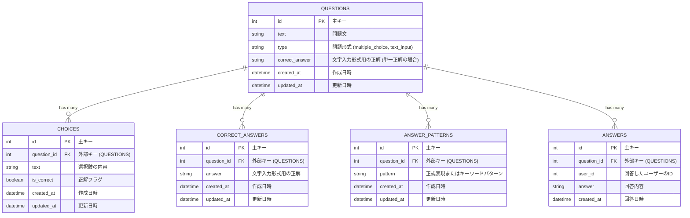

```mermaid
erDiagram
    QUESTIONS {
        int id PK "主キー"
        string text "問題文"
        string type "問題形式 (multiple_choice, text_input)"
        string correct_answer "文字入力形式用の正解 (単一正解の場合)"
        datetime created_at "作成日時"
        datetime updated_at "更新日時"
    }

    CHOICES {
        int id PK "主キー"
        int question_id FK "外部キー (QUESTIONS)"
        string text "選択肢の内容"
        boolean is_correct "正解フラグ"
        datetime created_at "作成日時"
        datetime updated_at "更新日時"
    }

    CORRECT_ANSWERS {
        int id PK "主キー"
        int question_id FK "外部キー (QUESTIONS)"
        string answer "文字入力形式用の正解"
        datetime created_at "作成日時"
        datetime updated_at "更新日時"
    }

    ANSWER_PATTERNS {
        int id PK "主キー"
        int question_id FK "外部キー (QUESTIONS)"
        string pattern "正規表現またはキーワードパターン"
        datetime created_at "作成日時"
        datetime updated_at "更新日時"
    }

    ANSWERS {
        int id PK "主キー"
        int question_id FK "外部キー (QUESTIONS)"
        int user_id "回答したユーザーのID"
        string answer "回答内容"
        datetime created_at "回答日時"
    }

    QUESTIONS ||--o{ CHOICES : "has many"
    QUESTIONS ||--o{ CORRECT_ANSWERS : "has many"
    QUESTIONS ||--o{ ANSWER_PATTERNS : "has many"
    QUESTIONS ||--o{ ANSWERS : "has many"

```
